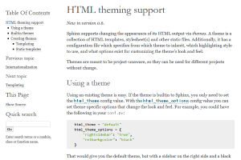
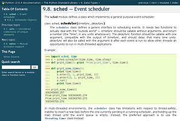
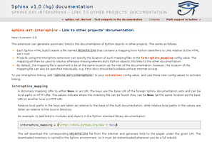

======================
Sphinx简单配置
======================

使用Sphinx进行创作
~~~~~~~~~~~~~~~~~~~~~
此时，我们已经正确安装了 Sphinx，查看了默认结构，并了解了一些基本语法。不要直接开始编写文档。缺乏布局和输出方面的知识会让您产生混淆，
可能耽误您的整个进程。现在来深入了解一下 index.rst 文件。它包含大量的信息和其他一些复杂的语法。为了更顺利地完成任务并避免干扰，我们
将合并一个新文件，将它列在主要章节中。在 index.rst 文件中的主标题之后，有一个内容清单，其中包括 toctree 声明。toctree 是将所有文档
汇集到文档中的中心元素。如果有其他文件存在，但没有将它们列在此指令下，那么在构建的时候，这些文件不会随文档一起生成。我们想将一个新文件
添加到文档中，并打算将其命名为 example.rst。还需要将它列在 toctree 中，但要谨慎操作。文件名后面需要有一个间隔，这样文件名清单才会有效，
该文件不需要文件扩展名（在本例中为 .rst）。下面会用实际例子进行演示。在文件名距离左边距有三个空格的距离，maxdepth 选项后面有一个空白行。

::

    Contents:
        .. toctree::
        :maxdepth: 2
        
        example

接下来，我们在Source目录中新建example.rst，并把下面的文本复制粘贴到其中并保存。

::

    This is a Title
    ===============
    That has a paragraph about a main subject and is set when the '='
    is at least the same length of the title itself.
    
    Subject Subtitle
    ----------------
    Subtitles are set with '-' and are required to have the same length 
    of the subtitle itself, just like titles.
    
    Lists can be unnumbered like:
    
    * Item Foo
    * Item Bar
    
    Or automatically numbered:
    
    #. Item 1
    #. Item 2
    
    Inline Markup
    -------------
    Words can have *emphasis in italics* or be **bold** and you can define
    code samples with back quotes, like when you talk about a command: ``sudo`` 
    gives you super user powers!

回到project的主目录中，打开命令提示符并运行make html。

::

    $ make html
    sphinx-build -b html -d _build/doctrees   . _build/html
    Making output directory...
    Running Sphinx v1.0.5
    loading pickled environment... not yet created
    building [html]: targets for 2 source files that are out of date
    updating environment: 2 added, 0 changed, 0 removed
    reading sources... [100%] index
    looking for now-outdated files... none found
    pickling environment... done
    checking consistency... done
    preparing documents... done
    writing output... [100%] index 
    writing additional files... genindex search
    copying static files... done
    dumping search index... done
    dumping object inventory... done
    build succeeded.
    
    Build finished. The HTML pages are in _build/html.

生成完毕后，打开build/html/index.html，即可查看自己刚刚生成的静态网站，刚刚写成的example.rst也已经转化成了html页面。

|pic1|

|pic2|

reStructuredText的详细语法、Sphinx模板的更改以及更多种样式的输出将在下面的章节进行详细介绍。

修改文界面语言为中文
~~~~~~~~~~~~~~~~~~~~~~~~~~~~
在conf.py中找到#language = None，修改为：language ='zh_CN'，其它支持语言见下表

* bn – Bengali
* ca – Catalan
* cs – Czech
* da – Danish
* de – German
* en – English
* es – Spanish
* fi – Finnish
* fr – French
* hr – Croatian
* it – Italian
* ja – Japanese
* lt – Lithuanian
* nl – Dutch
* pl – Polish
* pt_BR – Brazilian Portuguese
* ru – Russian
* sl – Slovenian
* tr – Turkish
* uk_UA – Ukrainian
* zh_CN – Simplified Chinese
* zh_TW – Traditional Chinese

设置html主题
~~~~~~~~~~~~~~~~~~~

找到html_theme = 'default'，修改default即可。

下面列举了几种常见的主题：

* agogo

|agogo|

* alabaster.png

|alabaster|

* bizstyle

|bizstyle|

* classic

|classic|

* haiku

|haiku|

* nature

|nature|
reStructuredText的详细语法、Sphinx模板的更改以及更多种样式的输出将在下面的章节进行详细介绍。

每种主题还有更进一步的设置选项，可以查看 http://www.sphinx-doc.org/en/master/theming.html。

.. |agogo| image:: assets/agogo.png

.. |nature| image:: assets/nature.png

本章小结
~~~~~~~~~~~~~~~~~~~~~~~~~~~~

学习完本章之后，应该能够

* 将自己创作的rst文档加入到sphinx的toctree中
* 更改sphinx的本地化设置
* 更改sphinx的主题