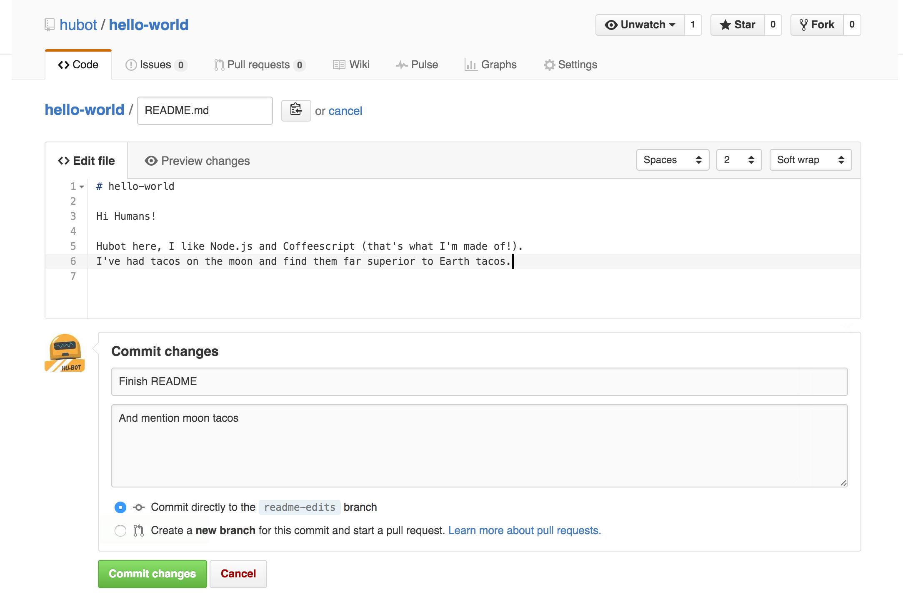

======================
多种形式发布Sphinx文档
======================

将Sphinx文档托管到ReadTheDocs平台上
-------------------------------------

ReadTheDocs是一个基于Sphinx的在线文档托管系统，接受一个Git Repository或SVN仓库作为文档来源，并会时刻同仓库保持同步。如果仓库中的
文档发生变化，ReadTheDocs也会实时进行更新。这样就避免了每次修改文档后都需要重新Build一遍的麻烦。通常我们选择把文档托管到GitHub平台
上。

GitHub是什么？
~~~~~~~~~~~~~~~~

GitHub是一个代码托管平台。利用GitHub，任何人都可以很方便地对代码进行版本控制或者团队协作。
Github基于git的代码托管平台。付费用户可以建私人仓库。一般的免费用户只能使用公共仓库，也就是代码要公开。
使用GitHub需要注册GitHub账号。注册地址：https://github.com/join

相关名词简介
+++++++++++++++++++

* Repository/Repo（仓库）

  ::

    类似于本地计算机上的文件夹。每个仓库对应着一组相关的代码文件。通常我们会为每一个单独的项目创建一个对应的Repo。

|repo|

* Branch（分支）

  ::

    分支相当于对某仓库的一个镜像。在重大的修改之前，可以先建立分支，确定没有Bug之后再将其commit到主分支中。

|branch|

* Commit（提交更改）

  ::

    每次对仓库中的代码进行修改后，需要将这部分修改的代码提交到GitHub上。这个提交的过程称之为commit。

|commit| 

.. |repo| image:: assets/create-new-repo.png
.. |branch| image:: assets/readme-edits.gif

将Sphinx工程文件夹上传到GitHub中
~~~~~~~~~~~~~~~~~~~~~~~~~~~~~~~~~~~~

1. 打开 `GitHub <https://github.com/>`_ ，并登录自己的账号。
#. 选择 ``New Repository`` 输入仓库的名称。
#. 在网页中打开自己的仓库，并选择 ``Upload files`` ，将Sphinx工程文件上传到GitHub仓库中。

注册ReadTheDocs账号并同步本人仓库
~~~~~~~~~~~~~~~~~~~~~~~~~~~~~~~~~~~~

注册Read the Docs，在Dashboard中创建一个新的Project，Repo中填入项目的git url。

剩下的一切就交给Read the Docs吧。

GitHub 里选择仓库，然后依次点击 Setting => Webhooks & Service => Add service => ReadTheDocs,激活这个选项。

到 ReadtheDocs import 这个仓库，导入成功后，点击阅读文档，便可看到 Web 效果了。

查看自己成功生成的页面
~~~~~~~~~~~~~~~~~~~~~~~~~~~~~~~~

登录ReadTheDocs之后即会进入 https://readthedocs.org/dashboard/ 页面，在下方的“项目”页面中即可看到所有已经上传的文档。打开自己需要的
文档后，会显示此文档的各个版本，点击对应的版本即可查看其html版本的效果。在项目概览页面也可以将其下载为其他格式。

将Sphinx发布为PDF文档
-------------------------------------

对英文文档而言，只需要在project目录下使用make latexpdf命令即可生成pdf文档。但是假如文档中有中文的话，最终的pdf文档会无法正常显示。
因此需要自己手动进行配置。

下载并安装texlive
~~~~~~~~~~~~~~~~~~~~~~~~~~~~~~~~
`texlive <http://www.tug.org/texlive/>`_ 是一款强大的排版软件，最终的文档需要由其编译生成。选择合适的镜像站可以大大缩小安装时间。

配置conf.py
~~~~~~~~~~~~~~~~~~~~~~~~~~~~~~~~

在conf.py中找到

::

    # -- Options for LaTeX output ------------------------------------------------

将其中的

::

    # Additional stuff for the LaTeX preamble.
    #
    # 'preamble': '',

取消注释，并将'preamble'的值修改为

::

    'preamble': r'''
    \hypersetup{unicode=true}
    \usepackage{CJKutf8}
    \DeclareUnicodeCharacter{00A0}{\nobreakspace}
    \DeclareUnicodeCharacter{2203}{\ensuremath{\exists}}
    \DeclareUnicodeCharacter{2200}{\ensuremath{\forall}}
    \DeclareUnicodeCharacter{2286}{\ensuremath{\subseteq}}
    \DeclareUnicodeCharacter{2713}{x}
    \DeclareUnicodeCharacter{27FA}{\ensuremath{\Longleftrightarrow}}
    \DeclareUnicodeCharacter{221A}{\ensuremath{\sqrt{}}}
    \DeclareUnicodeCharacter{221B}{\ensuremath{\sqrt[3]{}}}
    \DeclareUnicodeCharacter{2295}{\ensuremath{\oplus}}
    \DeclareUnicodeCharacter{2297}{\ensuremath{\otimes}}
    \begin{CJK}{UTF8}{gbsn}
    \AtEndDocument{\end{CJK}}'''

除以上必须配置的部分外，Options for LaTeX output中还有其他的选项可供设置，此处不再赘述。

生成Tex文件并编译为PDF文件
~~~~~~~~~~~~~~~~~~~~~~~~~~~~~~~~

在project目录下运行make latex后即可在build/latex文件夹中找到生成的tex文件。用texlive打开project.tex并用pdfLaTex进行编译即可
生成pdf文件。编译过程中会出现报错，但在控制栏中敲回车即可忽视这些报错，最终即可成功生成PDF文档。

本章小结
-------------------------------------

学习完本章后，应该可以

* 将sphinx项目上传至GitHub中并用ReadTheDocs发布
* 将sphinx项目发布为pdf格式